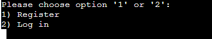

-------------------------------------------------------------
# Tools for borrow

## Introduction

Welcome to the Tools for borrow - system. This program aims to make life easier and cheaper for residents of an appartment building. Through registration the residents are provided with a system that will give insight in, and allow them to, borrow eachothers tools. 

## Table of Contents
1. [Project Goals](#project-goals)
    - [User Goals](#user-goals)
    - [Site Owner Goals](#site-owner-goals)
2. [User Experience](#user-experience)
    - [Target Audience](#target-audience)
    - [User Manual](#user-manual)    
    - [User Stories](#user-stories)
    - [Scope](#scope)
3. [Technical Design](#technical-design)
    - [Flowchart](#flowchart)
    - [Data Models](#data-models)   
4. [Technologies Used](#technologies-used)
    - [Languages](#languages)
    - [Frameworks and Tools](#frameworks-and-tools)
    - [Libraries](#libraries)
5. [Features](#features)
6. [Testing](#validation)
    - [Python Validation](#Python-validation)
    - [Testing user stories](#testing-user-stories)
8. [Bugs](#Bugs)
10. [Deployment](#deployment)
11. [Credits](#credits)
12. [Acknowledgements](#acknowledgements)

1. ## Project Goals
    - The goal of this project is ultimately to create a more sustainable way of living.
    - This project will aim to create a more circular economy through the exchange of equipment / tools, within a set group of people.

    ### User Goals
    - Be able to register / log in to a safe enviroment.
    - Add tools to a list, for other residents to use.
    - Search for the tools that I need.

    ### Site Owner Goals
    - Create an application with clear purpose.
    - Create an application that is intuitive and easy to navigate.
    - Create an application that will support the users need for tools.

    [Back to Table Of Contents](#table-of-contents)

2. ## User Experience
    ### Target Audience
    - The target audience is everyone who lives in an appartment building or small community and wants to have a cheaper more co-created way of living, through the sharing of equipment / tools. 

    ### User Manual

    

Click here to view instructions

    #### start menu
    After the welcome message in the start menu, the user is presented with two option. The first option will take the user into registration. The second option will take the user straight to log in. The user is aksed to choose either '1' or '2'.
    1. registration
    2. log in
    #### Registration
    With this option chosen, the user will enter a series of questions. The question are, first name, last name, phone number and unique password. Details on what to fill in will be stated in the moment. This input will all be registrated in a google sppreadsheet. 
    #### Log in
    With this option chosen, the user will have to enter last name and unique password for authentication. This information is pulled from the google spreadsheet during registration first time visisting. After log in, the user will enter the main menu.
    #### Main menu
    When entering the main menu, the user will be presented with 3 options. From here the user can interact with the main function, that is, to either add a tool, for other neighbours to find and borrow, to search for a tool that the user would like to borrow, or to exit the system entirely.
    1. add tool
    2. search tool
    3. exit
    #### Add tool
    In this add function, the user will be asked again to enter their last name. This is to make sure the tools added, are added in the right place. Then the user can add the name of the tool. This will then be updated in the spreadsheet and the user will get an overview of the tools they have logged. 
    #### Search tool
    In this section, the user will be asked to provide the name of the tool they are looking for. If the tool is found, the program will return a full name and number of the neighbour in possession of the tool. You will then be able to contact your neighbour, to ask for the tool.
    if not found, the user will be asked if they want to do another search or not. If chosen not, they will go back to the menu.
    #### Exit
    Exit will take you out of the system entirely.

    

    ### User Stories
    #### Resident user
    1. As a first time user I want to have a clear idea of the purpose of the application. 
    2. As a first time user I want to be able to register for the application.
    3. As a user I want to be able to log in.
    4. As a user I want to be able to search for a tool.
    5. I want to be able to see where I can borrow the tool.
    6. As a user I want to get feedback if the tool is not available or present.
    7. As a user I want to be able to add a tool to a list for others to use.
    8. As a user I want nagivation to be clear and easy.
    #### Site owner
    9. As a site owner I want registration and log in to be easy for the user.
    10. As a site owner I want user names and other information to be saved to a Google Spreadsheet.
    11. As a site owner I want input to be validated where necessary.
    12. As a site owner I want the user to be able to add and find a tool.
    13. As a site owner I want the user to get feedback if a tool is not available or present. 

    ### Scope
    - For the first release I want users to be able to register / log in, search and/or add tools, and be able to read where to borrow them or get feedback when not available or present.
    - For future releases I would like for users to be able to delete tools from the list, add unlimited tools, have multiple search result when more people are in possesion of the tool and add some more security.  
    
    [Back to Table Of Contents](#table-of-contents)

   

3. ## Technical Design

    ### Flowchart
    below you will find a flowchart which will show the flow and logic of this system. This chart was created with [Lucidchart](https://www.lucidchart.com/)

    

Flowchart

    

    ### Data Models
    I've chosen a more function oriented form of programming(FP), where I build function upon function in a very straightforward way to manipulate data in a google spreadsheet. Looking back, it would've been apropriate to use classes for example with a person/neighbour in the system, for they have a shared state, and shared actions. 
    
    [Back to Table Of Contents](#table-of-contents)

4. ## Technologies Used

    ### Languages
    - [Python](https://www.python.org/) programming language is the main language used for this system.

    ### Frameworks and Tools
    - [Gitpod](https://gitpod.io/) - is used for version control to push the code to GitHub.
    - [GitHub](https://github.com/) - is where I stored my code in a remote repository. 
    - [Lucidchart](https://www.lucidchart.com/) - is used to create the flowchart.
    - [Google Sheets](https://www.google.co.uk/sheets/about/) - is used to store data outside of this system.  
    - [Google Cloud Platform](https://cloud.google.com/cloud-console/) - is used for authentications and permissions to the google services, google auth and sheets etc.
    - [Google Sheets](https://www.google.co.uk/sheets/about/) is used to store user data like names, passwords, phone numbers and tools.
    - [Heroku Platform](https://dashboard.heroku.com/) is used to deploy this project into a live environment.
    - [PEP8](http://pep8online.com/) is used to check if the written code was up to Python standard.

    ### Libraries

    #### Python Libraries
    - os - is used to clear terminal when needed. I also find that it creates a better overview of the important information.
    - time - is used to delay certain print statements in the terminal for smooth effect and better flow.

    #### Third Party Libraries
    - [gspread](https://docs.gspread.org/en/latest/) - JUSTIFICATION: I used gspread to manipulate data (get, update and store information) in my Google spreadsheet
    - [google.oauth2.service_account](https://google-auth.readthedocs.io/en/master/) - JUSTIFICATION: This module is used for authentification that is needed to access the Google API and to connect my Service Account to the Credentials function. A creds.json file was added with all details the API needs.

    [Back to Table Of Contents](#table-of-contents)

5. ## Features

    ### Input validation

    - Input validation is done throughout the system where needed.
    - Through a loop, most of the places with input will redirect to either ask again or provide options.

    

    
Screenshot examples of asking again when input not valid

    
    
    

    ### Start menu

    - This provides the user with a welcome message.
    - It gives a short introduction to what to expect.
    - It provides the user with two options, to register(as a first time user) or to log in.
    - User stories covered: 1, 2, 3, 8

    

    
Screenshot of Start menu feature

    
    

    ### Registration

    - New users can register to the system.
    - One by one, a couple of questions are asked: names and phone number, to be saved in a spreadsheet.
    - After check if input is correct, unique password is asked to be created.
    - After this, the user will go directly to log in.
    - User stories covered: 2, 3, 9, 10, 11, 8

    

    
Screenshots of input names and number and a screenshot of unique password features

    
    
    

    ### Log In

    - Gives an existing user the opportunity to log in without registering again.
    - Is done on the basis of the last name and the unique password givin.
    - Input info is searched in google spreadsheet for authentication.
    - User stories covered: 3, 8, 9, 11

    

    
Screenshot of Log in feature

    
    

    ### Main menu

    - It's and easy to understand menu with clear navigation.
    - It provides the user with 3 options on wehre to go next: add tool, search tool or exit.
    - User stories covered: 4, 7, 8, 11, 12

    

    
Screenshot of Main menu feature

    
    
   

    ### Add tool

    - This will give the user the option to add a tool.
    - After adding a tool, this will give the user an overview of the tools in his/her possesion.
    - The user can add up to 8 tools, which will be stored in the google spreadsheet.
    - After the overview there will be a option menu with further instruction, to go back or exit.
    - User stories covered: 7, 8, 10, 12

    

    
Screenshots of the add tool feature

    
    
    
     

    ### Search tool

    - This will give the user the option to search for the tool he needs.
    - This is linked to google spreadsheet and will loop through all the data provided.
    - If not found, it will ask if another search is wanted.
    - If found, the user is provided with the name and number of the neighbour in possesion of the tool.
    - When ready, the user is provided with an option menu for easy navigation.
    - User stories covered: 4, 5, 6, 8, 12, 13

    

    
Screenshots of the search tool feature

    
    
    
   

    ### Exit

    - Will take the user out of the system. 
    - For easy navigation of the system.
    - User stories: 8  

    [Back to Table Of Contents](#table-of-contents)

6. ## Testing

    ### Python Validation

    [PEP8 Validation](http://pep8online.com/) was used to check the code for PEP8 requirements. All the code was pasted into the engine. Al the code passes with no errors and no warnings to show.

    ### Testing user stories

future reference:
- security, no adding tools to other people if you know their names. 
- Forgot password option.
- function for endless tool adding possibillity.
- multiple search results if more people have the same tool.
- take a tool out of the list.
